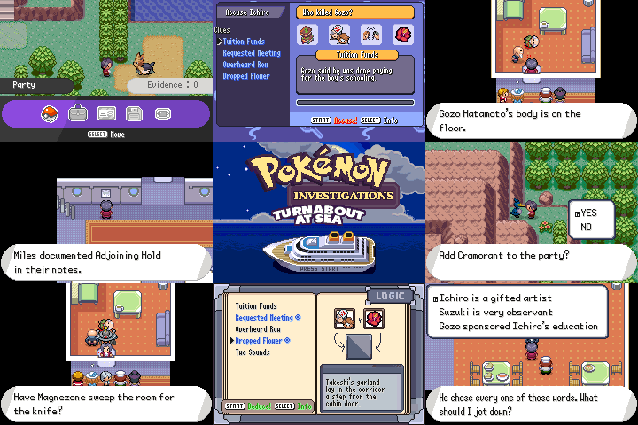

# Pokemon Investigations: Turnabout at Sea

Entry for TARC 3, by Miriam and Fisham

You are acclaimed prosecutor Miles Edgeworth, joined by Franziska von Karma, who have been stranded on Florio Island. A bride you’ve never met offers you a place on her family’s private boat, the SS Hana - but before long, there's been a murder. Work multiple crime scenes, gather evidence, make deductions, and name the killer.. or get it wrong, and send an innocent man to jail!

Turnabout at Sea combines Pokemon with an adapted story from Detective Conan and the gameplay loop from Ace Attorney Investigations. While there is a small amount of Pokemon catching & battling, it is a whodunnit first, and Pokemon game second.

Playtime: roughly 45 minutes for a single playthrough

Features:

**A complete, self-contained case:** one night, two suspects, twelve passengers aboard, and four key incidents to investigate.

**Pokemon involvement in the case:** Collect evidence with the assistance of your Pokemon, receive evidence from Trainers you beat in battles, and see how Pokemon influence the murder mystery.

**Turn evidence into a case:** discover 31 facts and combine them into deductions to understand the full sequence of events.

**Construct your argument:** Name your suspect and answer four questions by presenting evidence. You can’t just name the right suspect, you have to prove it.

**Five potential endings:** Depending on the evidence you provide, you could identify the right suspect, not have a strong enough argument to convince anyone, or even condemn an innocent man to jail.

**Feisty feedback:** Work with your companion, Franziska von Karma, to assess the crime scenes and make your accusations. If you’re wrong, she won’t let you live it down.

# Credits

### Playtesters

MaximeGr

Pommelo

### Feature Branches

Montblanc (SwSh Uis)

RavePossum (BW Summary Screen)

TheXaman (Options Menu)

### Tilesets

ekat99

AveonTrainer (Art Easles)

Morlock-Liam (Bathroom & Mirror)

Fisham (various edits)

### Overworlds

Miriam (Franziska/Edgeworth)

Eva (Edgeworth)

Aveontrainer (Natsue/Mariko)

Mashirosakura (Akie/Tatsuo)

Delta321 (Gozo)

Fisham (various edits)

### Other Assets

Miriam (Edgeworth trainer sprite)

Mudskip (Pokeball scrolling BG)

Eva (Pokemon Hearth)

Cursenho (UI Essentials Pack)

Glionox (Items pack)

### Music

Specker (universal voicegroup)

### Graphics Inspiration

PMD Explorers of Skies

PMD Red Rescue Team

Pokemon Hearth

### Story Inspiration

Detective Conan

### Music Inspiration

Ace Attorney

Ace Attorney Investigations

Castlevania Aria of Sorrow

### Tooling

ShantyTown (porydaw)

Specker (porydaw)

grunt-lucas (porytiles)

GriffinR (porymap)

### Misc Code

Hedara (even_sprite)

grunt-lucas (sample_ui)

ShantyTown (comfy_anims)

### Special Thanks

Eva

Gudf

MGriffin

SBird

Hedara

Lemmanade

Boyo

The Spriter's Resource

pret (pokeemerald)

RHH (pokeemerald-expansion)

### Emotional Support

GBATEK

TONC

# Developers

Miriam

Fisham
